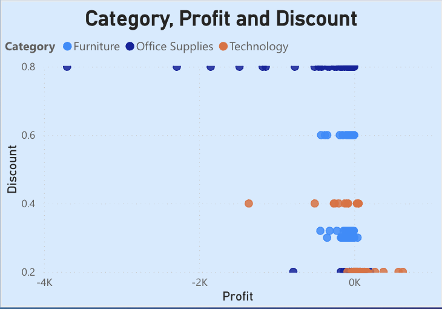

# Retail Analysis and Dashboard

This is a report detailing a data dashboard and analysis conducted for a retail company dataset. Below is our interactive PowerBI dashboard for retail analysis:

[View Dashboard](https://app.powerbi.com/reportEmbed?reportId=8fc87b28-00f5-4e38-bebd-c7dcb4668074&autoAuth=true&ctid=2109ce83-7de4-4471-91ff-2053f90a1fd9)

Note: This dashboard requires proper authentication and permissions to view.

### Executive summary

### Methodology and Data overview

The data used for this analysis is a synthetic dataset obtained from Kaggle. It contains around 10,000 rows of data from a retail store in America that sells a variety of products. The data contains various columns that highlight the product category, sales, shipping information and more.

Below is a sample of the data structure:

| Ship Mode    | Segment   | Country       | City        | State      | Postal Code | Region | Category        | Sub-Category | Sales  | Quantity | Discount | Profit  |
| ------------ | --------- | ------------- | ----------- | ---------- | ----------- | ------ | --------------- | ------------ | ------ | -------- | -------- | ------- |
| Second Class | Consumer  | United States | Henderson   | Kentucky   | 42420       | South  | Furniture       | Bookcases    | 261.96 | 2        | 0        | 41.9136 |
| Second Class | Consumer  | United States | Henderson   | Kentucky   | 42420       | South  | Furniture       | Chairs       | 731.94 | 3        | 0        | 219.582 |
| Second Class | Corporate | United States | Los Angeles | California | 90036       | West   | Office Supplies | Labels       | 14.62  | 2        | 0        | 6.8714  |

**Limitations**:
The dataset is not perfect due to a few reasons. First it lacks an index column for time so we cannot do any time-series analysis which could have been used to gain insights. Another limitation is in the fact that this dataset is synthetic so it may not be completely accurate and could have some unusual relations.

The data was then used to make a Power BI dashboard to visualize the data and gather insights. The dashboard has 2 pages, one for sales and another for profit.

### Key insights

**Sales:**
Certain states have lack of variety in products as they are selling products from just 1 or 2 categories.

-   Wyoming and North Dakota: Selling 1 category of products
-   West Virginia: Selling 2 categories of products

**Profit:**

1. **Lack of discounts and offering discounts for the wrong products:**
   Certain states offer no discounts which can limit sales. Most states have not went on any sales at all or have offered a limited number of discounts. Even though higher discounts and correlated with lower profits, it is important to attract customers through discounts.
   Some states even offer too many discounts and sometimes for the wrong categories. Such as Texas which despite having one of the highest sales, makes a huge loss. One reason this could have occured is due to Texas offering many discounts up to 80% for office supplies. Office supplies already have a smaller profit margain so discounts like that simply make it a losing product.

Ohio has also offered discounts up to 80% for products that have lead to great losses.

2. **Most profitable categories**
   Technology has earned the most profit despite being the least common product category and Furniture has barely turned a profit across all of America. Copies, phones and accesories being the most profitable sub-categories.

### Recommendation
